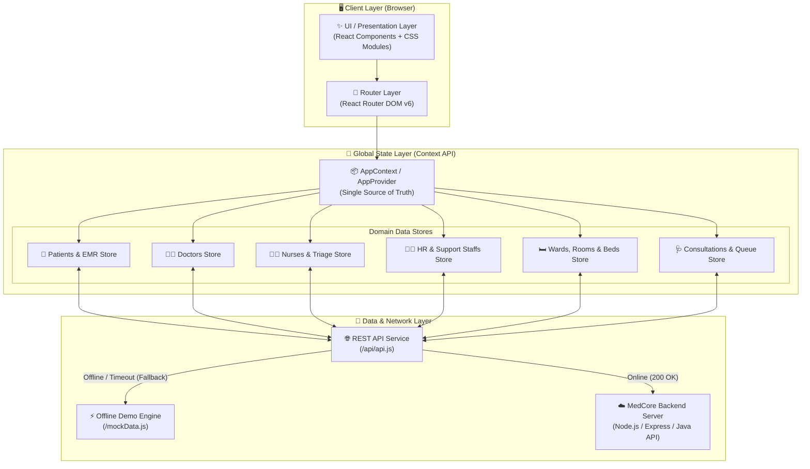
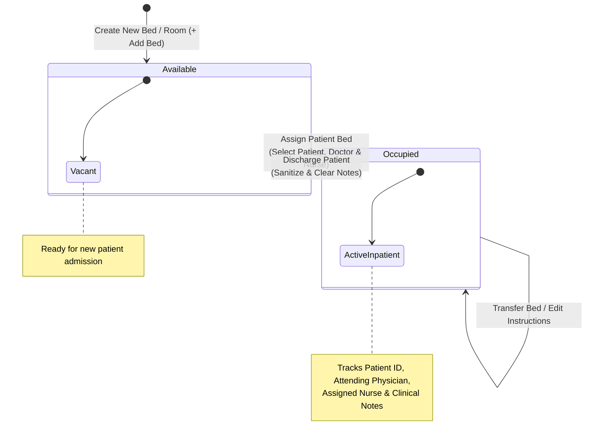
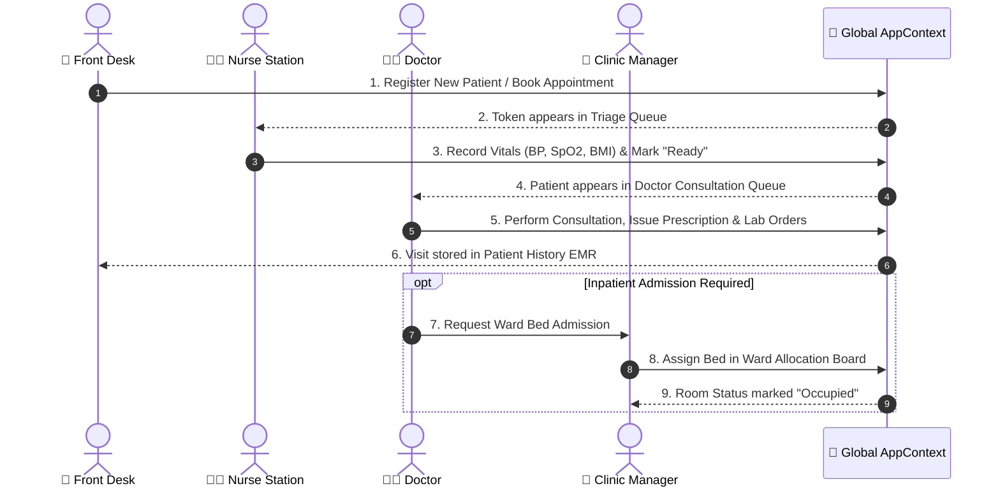

# 🏥 Aarogya Clinic ERP — System Architecture & Block Diagram

This document illustrates the complete architectural design, component hierarchy, state flow, and functional modules of the **Aarogya Clinic Management System** frontend application.

---

## 1. 🏗️ High-Level System Architecture Block Diagram

The application is engineered as a modern, responsive Single Page Application (SPA) using **React**, **Vite**, **Vanilla CSS Modules**, and **React Router DOM**. It implements a dual-mode data architecture that automatically falls back to an in-memory reactive demo engine when the backend API is offline.



---

## 2. 🧩 Component & Layout Hierarchy

The UI layout is structured around an enterprise ERP container that divides navigation, system notifications, and dynamic workspace pages.

```mermaid
graph TD
    App["🏁 App.jsx<br/>(Root Application Wrapper)"] --> Provider["🧠 AppProvider<br/>(Global Context Injection)"]
    Provider --> Layout["🖥️ ERP App Layout Container"]
    
    Layout --> Sidebar["📂 Sidebar.jsx<br/>(Role-Based Navigation & Portals)"]
    Layout --> Main["🗂️ Main Content Area"]
    
    Main --> TopBar["⚡ TopBar.jsx<br/>(Quick Search, Date/Time & Notifications)"]
    Main --> Banner["⚠️ OfflineBanner<br/>(Demo Mode Status Notice)"]
    Main --> Content["📜 Dynamic Route View Container"]
    
    subgraph NavigationSections ["Sidebar Navigation Sections"]
      Sidebar --> ManagerPortal["🏢 Manager Portal Dropdown"]
      Sidebar --> ClinOps["🏥 Clinical Operations"]
    </subgraph>
    
    subgraph Pages ["Page Modules (Rendered in Content)"]
      Content --> Reg["📝 Registration Module"]
      Content --> Pat["👥 Patients Directory Module"]
      Content --> Doc["👨‍⚕️ Doctors Roster Module"]
      Content --> Nur["👩‍⚕️ Nurses & Triage Module"]
      Content --> Appt["📅 Appointments Module"]
      Content --> Cons["🩺 Consultation & EMR Module"]
      Content --> Mgr["🏢 Executive Manager Hub"]
    </subgraph>
```

---

## 3. 🏢 Functional Workspace Modules

The system is organized into **4 primary domain modules**, each providing specialized workflows for different hospital roles:

```mermaid
graph LR
    subgraph FrontDesk ["1️⃣ Front Desk & Reception"]
        R1["Register Patient<br/>(Demographics, KYC & Insurance)"]
        R2["Patient Directory<br/>(Search, History & Cards)"]
        R3["Appointment Scheduling<br/>(Token & Time Slot Allocation)"]
    end

    subgraph Nursing ["2️⃣ Nursing & Triage Station"]
        N1["Triage Vitals Capture<br/>(BP, Pulse, Temp, SpO2, BMI)"]
        N2["Nurse Queue Management<br/>(Mark Patient Ready for Doc)"]
        N3["Nurses Directory<br/>(Shift & Roster Management)"]
    end

    subgraph DoctorsMod ["3️⃣ Medical & Consultation"]
        D1["Live Consultation Queue<br/>(Token-based Patient Calling)"]
        D2["EMR Prescription Writing<br/>(Diagnosis, Medicines & Lab Tests)"]
        D3["Patient Medical History<br/>(Past Visits, Vitals & Notes)"]
    end

    subgraph ManagerMod ["4️⃣ Executive Manager Portal"]
        M1["Manager Overview Dashboard<br/>(KPIs, Revenue & Live Occupancy)"]
        M2["Staffs & HR Roster<br/>(Receptionists, Techs, Janitors)"]
        M3["Ward & Bed Allocation Board<br/>(Assign Beds, Transfer & Discharge)"]
        M4["Hospital Inventory<br/>(+ Add Ward, + Add Bed / Suite)"]
    end

    FrontDesk --> Nursing
    Nursing --> DoctorsMod
    ManagerMod --> FrontDesk & Nursing & DoctorsMod
```



---

## 4. 🛏️ Ward & Room Allocation Architecture

The **Room & Bed Allocation** subsystem enables dynamic hospital capacity management and live inpatient tracking:



---

## 5. 🔄 Patient EMR Lifecycle & Data Flow

When a patient interacts with the clinic, their data seamlessly transitions through the functional layers without requiring page reloads:



---

## 6. 🛠️ Technology Stack & Design Specifications

| Layer | Technology | Description |
| :--- | :--- | :--- |
| **Frontend Framework** | React 18 (SPA) | Component-based UI rendering with declarative state views |
| **Build Tooling** | Vite v5 | High-performance bundling, HMR, and optimized production builds |
| **Routing** | React Router DOM v6 | Role-based layout transitions and deep linking (`/manager/dashboard`, `/rooms/assign`, etc.) |
| **Styling Architecture** | Vanilla CSS Modules | Scoped component styling, zero-collision class names, and rich modern aesthetics |
| **Icons & UI Graphics** | Lucide React | Clean, scalable vector iconography for medical and administrative workflows |
| **State Management** | React Context API | Single-source-of-truth global provider managing asynchronous data sync |
| **Offline Resilience** | Fallback Interceptor | Automatically switches to in-memory reactive mock databases when API is offline |
